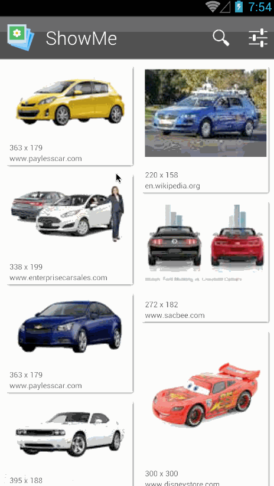

# Project 2 - *Name of App Here*

**Name of your app** is an android app that allows a user to search for images on web using simple filters. The app utilizes [Google Image Search API](https://developers.google.com/image-search/). Please note that API has been officially deprecated as of May 26, 2011.

Time spent: **15** hours spent in total

## User Stories

The following **required** functionality is completed:

* [x] User can **search for images** by specifying a query and launching a search. Search displays a grid of image results from the Google Image API.
* [x] User can click on "settings" which allows selection of **advanced search options** to filter results
* [x] User can configure advanced search filters such as:
  * [x] Size (small, medium, large, extra-large)
  * [x] Color filter (black, blue, brown, gray, green, etc...)
  * [x] Type (faces, photo, clip art, line art)
  * [x] Site (espn.com)
* [x] Subsequent searches have any filters applied to the search results
* [x] User can tap on any image in results to see the image **full-screen**
* [x] User can **scroll down to see more images**. The maximum number of images is 64 (limited by API).

The following **optional** features are implemented:

* [x] Implements robust error handling, [check if internet is available](http://guides.codepath.com/android/Sending-and-Managing-Network-Requests#checking-for-network-connectivity), handle error cases, network failures
* [x] Used the **ActionBar SearchView** or custom layout as the query box instead of an EditText
* [x] User can **share an image** to their friends or email it to themselves
* [x] Replaced Filter Settings Activity with a lightweight modal overlay
* [x] Improved the user interface and experiment with image assets and/or styling and coloring

The following **bonus** features are implemented:

* [x] Used the [StaggeredGridView](https://github.com/f-barth/AndroidStaggeredGrid) to display improve the grid of image results
* [x] User can [zoom or pan images](https://github.com/MikeOrtiz/TouchImageView) displayed in full-screen detail view

The following **additional** features are implemented:

* [x] Persist user preferences to local file
* [x] Used 9-pitch image to decorate item background

## Video Walkthrough 

Here's a walkthrough of implemented user stories:

Demo of Error Handling:

GIF created with [LiceCap](http://www.cockos.com/licecap/).

## Notes

Describe any challenges encountered while building the app.

- I tried to use the stock "back" arrow to navigate back to the main activity from the image viewer, but
  it does not navigate back, instead, it starts a new instance of the main activity

- There is an unresolved bug: when changing type and color filter, the data is not refreshed, but instead appended.
  Although this does not happen for change of size filter and site filter. They are using the same part of code
  so I was not quite sure what cause the difference.

## Open-source libraries used

- [Android Async HTTP](https://github.com/loopj/android-async-http) - Simple asynchronous HTTP requests with JSON parsing
- [Picasso](http://square.github.io/picasso/) - Image loading and caching library for Android
- [Jackson](https://github.com/FasterXML/jackson) - POJO-JSON object mapping
- [StaggeredGrid](https://github.com/etsy/AndroidStaggeredGrid) - Staggered Grid
- [TouchImageView](https://github.com/MikeOrtiz/TouchImageView) - Image Vie with Pan and Zoom
- [Progress for List View](https://gist.github.com/nesquena/a988aac278cff59a9a69) - Add progress at the end of list view
- [EndlessScroll](http://guides.codepath.com/android/Endless-Scrolling-with-AdapterViews) - live loading list view
- [Material Dialog](https://github.com/afollestad/material-dialogs) - Material dialog library

## License

    Copyright [2015] [William Lian]

    Licensed under the Apache License, Version 2.0 (the "License");
    you may not use this file except in compliance with the License.
    You may obtain a copy of the License at

        http://www.apache.org/licenses/LICENSE-2.0

    Unless required by applicable law or agreed to in writing, software
    distributed under the License is distributed on an "AS IS" BASIS,
    WITHOUT WARRANTIES OR CONDITIONS OF ANY KIND, either express or implied.
    See the License for the specific language governing permissions and
    limitations under the License.